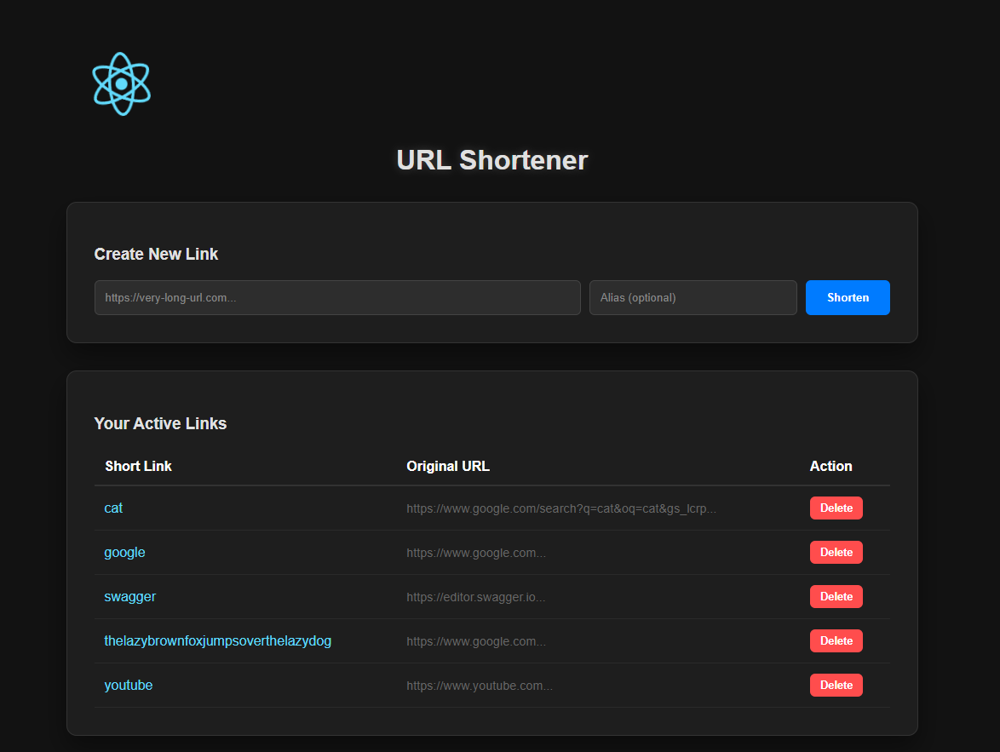

# TPX Impact URL Shortener Tool

URL Shortener project built with a Java 17 Spring Boot backend and a decoupled ReactJS frontend. Data is stored on a separate database which needs to be set up as a prerequisite.

Follow the build steps below to run the app locally or containerised in Docker

Time spent: roughly ~ 8 - 10 hours

## Features

- **Shorten URLs:** Generate a random alias or provide a custom one
- **Persistence:** Shortened URLs are saved to a MySQL database and persist across restarts
- **RESTful API:** Create, Read, Delete URLs following the provided [`openapi.yaml`](./openapi.yaml) spec
- **Decoupled Frontend:** A simple modern React UI to interact with the API
- **Validation:** Strict input validation and graceful error handling on both ends

---

## Tech Stack
- **Backend:** Java 17, Spring Boot, Spring Data JPA, Hibernate
- **Frontend:**  React, Node, Nginx
- **Database:**  MySQL
- **Testing:**  JUnit 5, Mockito
- **Containerisation:**  Docker & Docker Compose

### Prerequisites

- **Running Locally:** 
  - Java 17+
  - Maven 3.5+
  - Node.js 18+
  - Running MySQL database on localhost:3306


- **Running in Docker:**
  - Docker Desktop/CLI
  - Running MySQL database on localhost:3306

**Note** You can run a database in Docker with the following command:

`docker run -d --name mysql-db -p 3306:3306 -e MYSQL_ROOT_PASSWORD=localdev -e MYSQL_DATABASE=url_shortener_db mysql:latest`
## Build and run steps

- **Running Locally:**
  - Backend API
    - `cd backend-api`
    - `mvn spring-boot:run`
  - Frontend UI
    - `cd frontend-ui`
    - `npm install`
    - `npm start`


- **Running in Docker:**
  - From the url-shortener parent directory run:
  - `docker-compose up --build` (optional: -d flag for headless run)

You can now view your running frontend application on http://localhost:3000 with backend requests running on http://localhost:8080

**NOTE**: Application may fail to work as expected with no available running database 

---

## Project Structure

```
url-shortener
├── backend-api/          # Spring Boot Application
│   ├── src/              # Logic & Tests
│   └── Dockerfile        # Multi-stage Java build
├── frontend-ui/          # React Application
│   ├── src/              # UI Components
│   ├── nginx.conf        # Routing & Proxy config
│   └── Dockerfile        # Node build + Nginx serve
├── docker-compose.yml    # Orchestration
├── openapi.yaml          # Swagger
└── pom.xml               # Parent Maven Project
```
---

## Example Frontend

